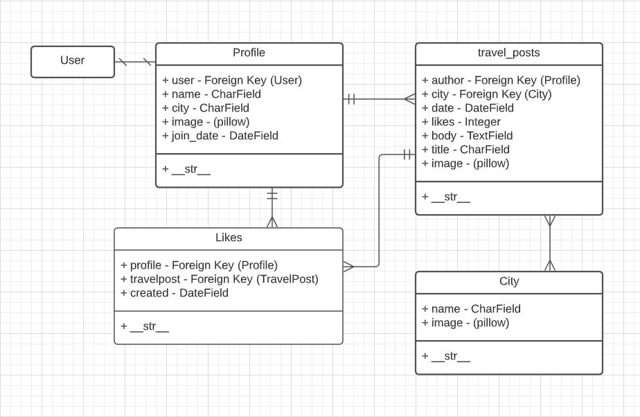

# **Anywere. Else.**

"Anywhere. Else." was built by a team of 4 developers who were commissioned to build a travel community for users to share posts about their favorite locations around the world.

## Index
- [User Stories](#user-stories)
- [ERD](#erd)
- [Collaborators](#collaborators)
- [Technologies](#technologies)

## **User Stories**
### **Sprint 1: Basic Auth & Profiles**
**Users are able to:**

1. Land on a basic splash page with:

- The name of the website.
- Links to "Log In" and "Sign Up".

2. Sign up for an account.
3. Log in to their account if they already have one.
4. Be redirected to their public profile page after logging in.
5. On their public profile page, see their name, the current city they have set in their profile, and their join date.
6. See the site-wide header on every page with:

- A link to "Log Out" if they're logged in.
- A link to their profile if they're logged in.
- A link to the cities index page.

7. Update their profile by making changes to their name, current city, and/or profile image.
8. See the titles of all the posts they've contributed.
9. Click on the title of one of their posts and be redirected to a "show" page for that post.
10. View post "show" pages with title, author, and content.

### **Sprint 2: CRUD**

**Users are able to:**

1. View a city's page including:

- The name of the city.
- An iconic photo of the city.

2. View a list of posts on that city's page:

- Relating to that city.
- Sorted by newest first.
- With the post titles linked to the individual post "show" pages.
- See post content truncated to 1000 characters max, with a link to view more.

3. Use an "Add New Post" button on the city's page to pull up the new post form.
4. Create a new post for that city.
5. Click "Edit" on ANY individual post, and be redirected to the edit form.
6. Click "delete" on ANY individual post, then:

- See a pop-up that says: "Are you sure you want to delete post?"
- If the user confirms, delete the post.

### **Sprint 3: Validations & Authorization**

**Users are able to:**

1. Verify that a new post they create is successfully published on the correct city page.

A user CANNOT save invalid data to the database, according to the following rules:

2. A user CANNOT sign up with an email (or username) that is already in use.
3. A post's title must be between 1 and 200 characters.
4. A post's content must not be empty.

A user is authorized to perform certain actions on the site, according to the following rules:

5. A user MUST be logged in to create/update/destroy resources.
6. A user may only edit their own profile and edit/delete their own posts.

## ERD

## Collaborators
* Katie Hermalik
* Josh Sanford
* Brendan Howe
* Morgan Jaouni

## Technologies
* Python
* Django
* PostgreSQL
* Pillow
* Skeleton